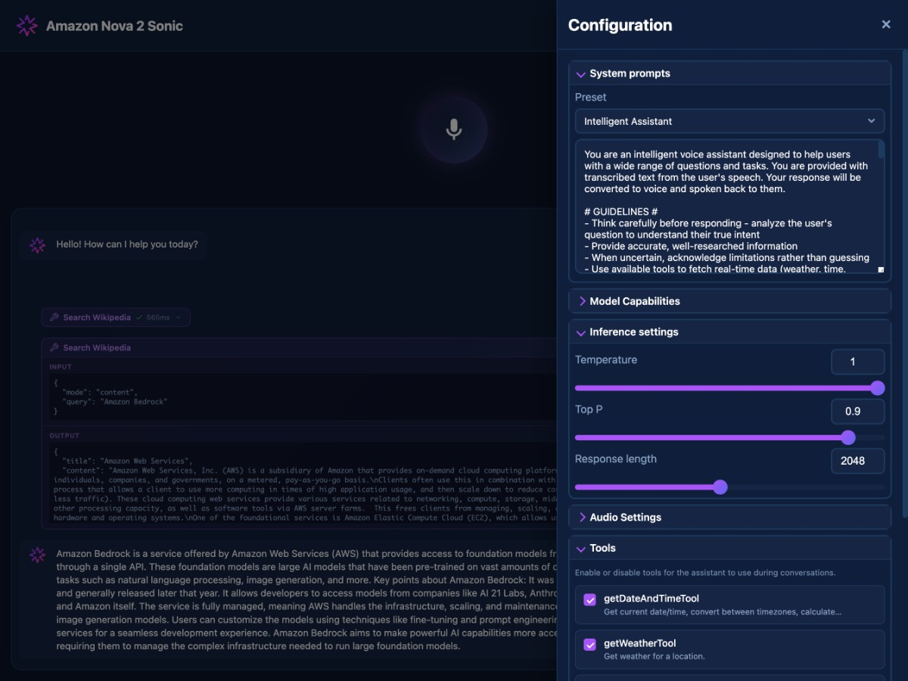

# Conversational AI with Amazon Nova 2 Sonic

A sample implementation of real-time voice assistant using [Amazon Nova 2 Sonic](https://aws.amazon.com/ai/generative-ai/nova/speech/), AWS's speech-to-speech foundation model. Talk naturally with an AI that listens, thinks, and responds — all in real-time with human-like conversation flow.


## Features

### Unified Speech-to-Speech Model
Unlike traditional pipelines (ASR → LLM → TTS), a speech-to-speech model processes audio input and generates audio output directly in a single model, preserving acoustic context like tone, pace, and emotion.

### Natural Conversation Flow
- **Turn-Taking** — Detects pauses, hesitations, and non-verbal cues to know when to respond
- **Barge-In** — Gracefully handles interruptions mid-response without losing context
- **Adaptive Speech** — Adjusts response tone and pace based on how you speak, not just what you say
- **Low Latency** — Bidirectional streaming delivers responses as they're generated

### Voice & Language
- **Multiple Voices** — Tiffany (feminine) and Matthew (masculine) with native expressivity
- **Polyglot Support** — Voices can switch languages within the same conversation
- **Text Input Mode** — Switch to typing when voice isn't convenient (crossmodal interaction)
- **Languages** — Officially supports English (US/UK), Spanish, French, German, Italian, Portuguese, and Hindi. Other languages like Chinese and Japanese should also work.

### Tool Calling
Nova 2 Sonic supports asynchronous function calling — the model can invoke tools while continuing the conversation, then incorporate results naturally when they return. See [src/tools](src/tools) for implementation. You can enable each of these tools individually in UI.

| Tool | Description |
|------|-------------|
| DateTime | Current date and time |
| Weather | Weather forecasts via Open-Meteo API |
| Wikipedia | Search and retrieve Wikipedia articles |
| Location Search | Find places and coordinates |
| Reasoning | Extended thinking for complex questions |
| Transcript Correction | Fix ASR transcription errors |


## Architecture

```
┌─────────────────┐     Socket.IO     ┌─────────────────┐    AWS Bedrock    ┌─────────────────┐
│   Browser UI    │◄─────────────────►│  Express Server │◄─────────────────►│  Nova 2 Sonic   │
│   (JavaScript)  │   WebSocket       │   (TypeScript)  │   Bidirectional   │  Model          │
└─────────────────┘                   └─────────────────┘   Streaming       └─────────────────┘
```

Audio is captured via Web Audio API (16kHz mono PCM), streamed through Socket.IO to an Express server, then forwarded to Nova 2 Sonic via AWS Bedrock's bidirectional streaming API. Responses (24kHz audio + text transcripts) flow back in real-time.

## Screenshots




## Quick Start

### Prerequisites

- Node.js 18+
- AWS account with [Amazon Bedrock access](https://docs.aws.amazon.com/bedrock/latest/userguide/model-access.html) to Nova 2 Sonic
- AWS credentials configured

### Setup

```bash
npm install

# Configure AWS credentials
export AWS_PROFILE=your-profile
# or
export AWS_ACCESS_KEY_ID=xxx && export AWS_SECRET_ACCESS_KEY=xxx

# (optional) Listen incoming connections on all available network interfaces
export HOST=0.0.0.0

# Compile and run application
npm run build
npm start

# Alternatively you can run in development mode for easier debugging
npm run dev
```

Open `http://localhost:3000` and click the microphone to start talking.


## Configuration

Settings are adjustable from the UI panel:

| Setting | Description |
|---------|-------------|
| Voice | Choose between Tiffany or Matthew personas |
| Response Timing | Controls voice activity detection sensitivity — faster means quicker responses but may cut off longer pauses |
| Audio Quality | Output sample rate — higher quality uses more bandwidth |
| Initial Buffer | Audio buffer before playback starts — lower means faster response, higher means smoother playback |
| Temperature | Higher values produce more varied responses |
| Top P | Controls response diversity via nucleus sampling |
| Max Tokens | Limits response length |
| AWS Region | Select a closer region to reduce latency |

## System Prompts

Pre-built personas available in [public/prompts](public/prompts):

- **Friendly Chat** — Casual conversational assistant
- **Insurance Service** — Customer service agent
- **Intelligent Assistant** — General-purpose with tool usage
- **Math Tutor** — High school math teacher

## Resources

- [Amazon Nova 2 Sonic Announcement](https://aws.amazon.com/blogs/aws/introducing-amazon-nova-2-sonic-next-generation-speech-to-speech-model-for-conversational-ai/)
- [Nova Sonic User Guide](https://docs.aws.amazon.com/nova/latest/userguide/speech.html)
- [AWS Bedrock Pricing](https://aws.amazon.com/bedrock/pricing/)

## Security

See [CONTRIBUTING](CONTRIBUTING.md#security-issue-notifications) for more information.

## License

This library is licensed under the MIT-0 License. See the [LICENSE](LICENSE) file.
